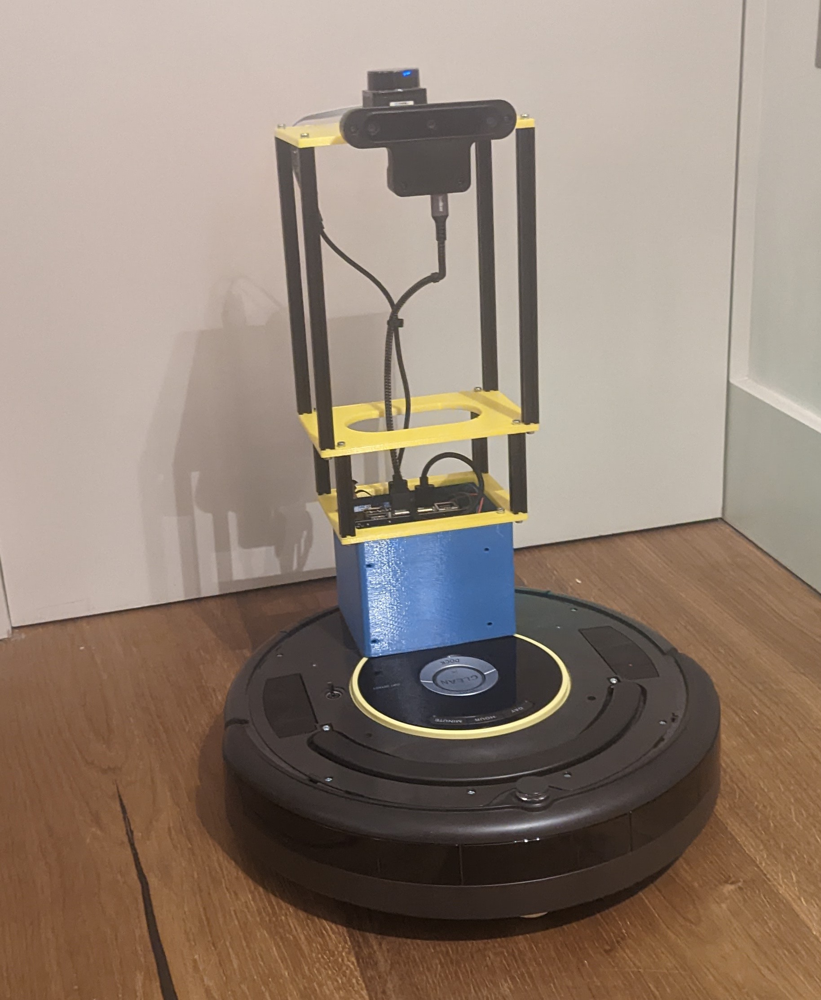

# Shoebot



Shoebot is an autonomous home robot designed to achieve the following tasks:

* Floor cleaning
* Watering plants
* Transporting errant shoes back to the shoe rack

Shoebot is made up of the following components and sensors:

* iRobot Create2 Base
* Jetson Nano
* LD19 LIDAR
* Opencv OAK-D Camera
* Dynamixel Servos

## Installation

Clone this repo

```bash
cd ~/shoebot_ws/src
git clone git@github.com:richardw347/shoebot.git
```

## Usage

```bash
ros2 launch shoebot_bringup bringup.launch.py
```

## Project plans and objectives

### Phase 1 Physical Construction & Sensor Integration (complete)

The objective of this phase of the project is to physically mount the Jetson nano and sensors to the base, wiring up power and sensor cables. Write a ROS 2.0 package for the robot including URDF, launch files and gazebo simulation.

### Phase 2 Autonomous Navigation & Data Collection

The objective of this phase of the project is to create a Nav 2.0 package for the robot and configure it be able to autonomously navigate around my flat. The second step is to create a script to autonomously navigate around the flat stopping at the locations of all plants and capturing several images so a plant detector can be trained.

### Phase 3 Network Training and Testing

The objective of this phase of the project is a train a network to detect the plants, I will perhaps do some tests with a Mobilenet SSD v2 or Yolo v7 to see which performs the best on the task and runs the fastest on the Jetson. It's likely the Mobilenet will run faster but be less accurate then Yolo. Let's see what the data says.

### Phase 4 Sprayer & Pump Integration

In order to water (or mist) the plants I intend to use a simple dc motor water pump and a sprayer nozzle mounted to some servos on the robot so it can automatically adjust it's aim. This is likely to require some modification to the frame but will only be done once the network has been trained and tested.

### Phase 5 Autonomous Watering

In ths phase the goal is to integrate the sprayer control with the autonomous navigation and allow the robot to autonomously water the plants. I've started working on my own Behavior Tree library Red Oak which I intend to use for the behaviors in this part.
